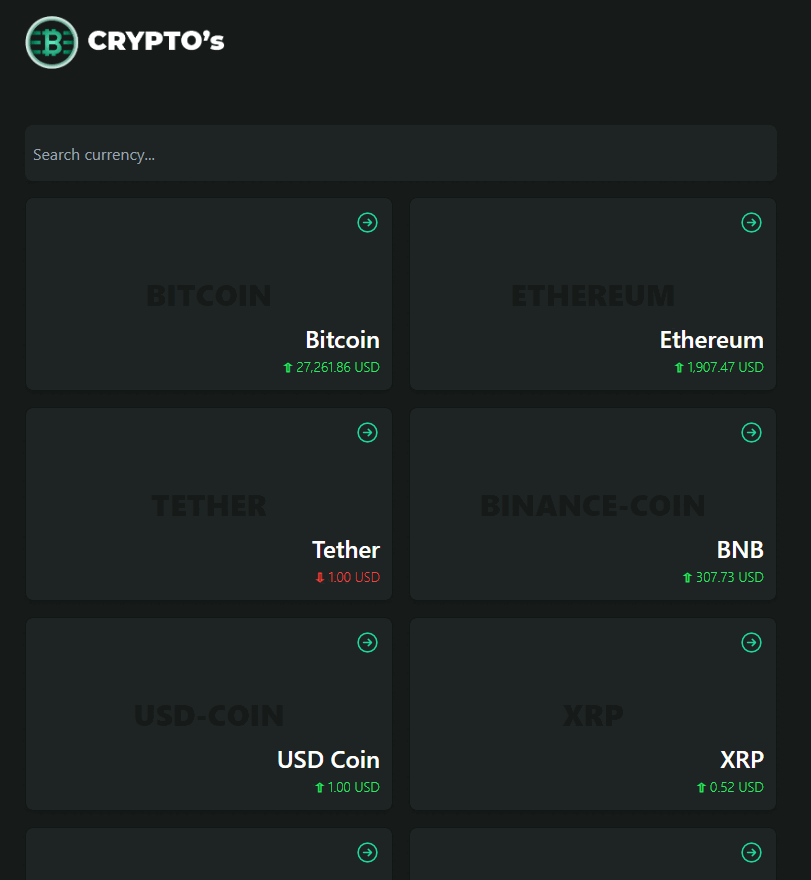

<a name="readme-top">
    
</a>
<br /><br />

<!-- TABLE OF CONTENTS -->

# 📗 Table of Contents

- [📖 About the Project](#about-project)
  - [🛠 Built With](#built-with)
    - [Tech Stack](#tech-stack)
    - [Key Features](#key-features)
- [💻 Getting Started](#getting-started)
  - [Setup](#setup)
  - [Prerequisites](#prerequisites)
  - [Install](#install)
  - [Usage](#usage)
  - [Run tests](#run-tests)
  - [Deployment](#triangular_flag_on_post-deployment)
- [👥 Authors](#authors)
- [🔭 Future Features](#future-features)
- [🤝 Contributing](#contributing)
- [⭐️ Show your support](#support)
- [🙏 Acknowledgements](#acknowledgements)
- [📝 License](#license)

<!-- PROJECT DESCRIPTION -->

# 📖 Crypto Coin <a name="about-project"></a>

**Crypto Coin** is a project of creating a responsive web app using React, Redux, Tailwindcss, Rechart library and Behance design to design the layout.

Screenshot :



## 🛠 Built With <a name="built-with"></a>

### Tech Stack <a name="tech-stack"></a>

- React
- Redux
- Linters
- TailwindCss

<details>
  <summary>Client</summary>
  <ul>
    <li><a href="">React</a></li>
  </ul>
</details>

<!-- Features -->

### Key Features <a name="key-features"></a>

- **[Use React to components]**
- **[Use API to fetch data and display in the UI]**
- **[Use navigation to create a 2 page app]**

<p align="right">(<a href="#readme-top">back to top</a>)</p>

## 🚀 Live Demo <a name="live-demo"></a>

- [Live Demo Link](https://profound-cendol-db4de9.netlify.app/)

<p align="right">(<a href="#readme-top">back to top</a>)</p>

<!-- GETTING STARTED -->

## 💻 Getting Started <a name="getting-started"></a>

This project is useful and important as it gives developers an experience of how to use React and Redux and APIs to create home and details page.

To get a local copy up and running, follow these steps.

### Prerequisites

In order to run this project you need a compatible browser to load the html file

### Setup

Clone this repository to your desired folder:

```sh
  cd my-folder
  git clone https://github.com/yusufobr/crypto-data.git
```

### Install

Install this project with:

```sh
  cd crypto-data
  npm install
```

### Usage

```sh
  npm start
```

### Run tests

To run tests, run the following command:

```sh
  npm run test
```

<p align="right">(<a href="#readme-top">back to top</a>)</p>

<!-- AUTHORS -->

## 👥 Authors <a name="authors"></a>

👤 Youssef OUBARI

- GitHub: [@yusufobr](https://github.com/yusufobr)
- Twitter: [@OubariY](https://twitter.com/OubariY)
- LinkedIn: [Youssef OUBARI](https://www.linkedin.com/in/youssef-oubari-370451147)

<p align="right">(<a href="#readme-top">back to top</a>)</p>

<!-- FUTURE FEATURES -->

## 🔭 Future Features <a name="future-features"></a>

- [ ] **[More styling]**
- [ ] **[Modification of appearance to look awesome]**

<p align="right">(<a href="#readme-top">back to top</a>)</p>

<!-- CONTRIBUTING -->

## 🤝 Contributing <a name="contributing"></a>

Contributions, issues, and feature requests are welcome!

<p align="right">(<a href="#readme-top">back to top</a>)</p>

<!-- SUPPORT -->

## ⭐️ Show your support <a name="support"></a>

If you like this project please like and share. You can also reach out to my portfolio so we can have further discussions.

<p align="right">(<a href="#readme-top">back to top</a>)</p>

<!-- ACKNOWLEDGEMENTS -->

## 🙏 Acknowledgments <a name="acknowledgements"></a>

Original design idea by [Nelson Sakwa](https://www.behance.net/sakwadesignstudio) on Behance.

I would also like to thank my partners and reviewers of the code for helping make the site better.

<p align="right">(<a href="#readme-top">back to top</a>)</p>

<!-- LICENSE -->

## 📝 License <a name="license"></a>

This project is [MIT](./MIT.md) licensed.

<p align="right">(<a href="#readme-top">back to top</a>)</p>
